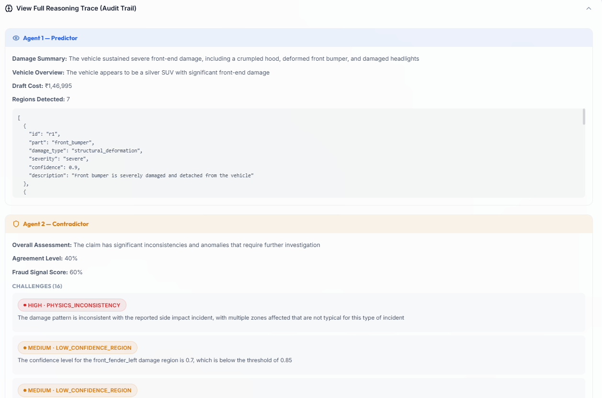
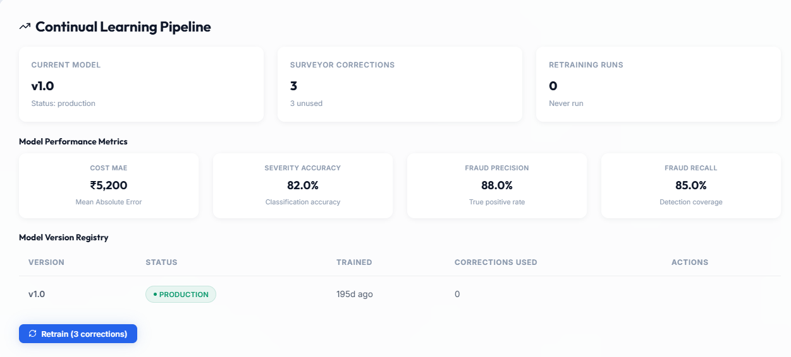
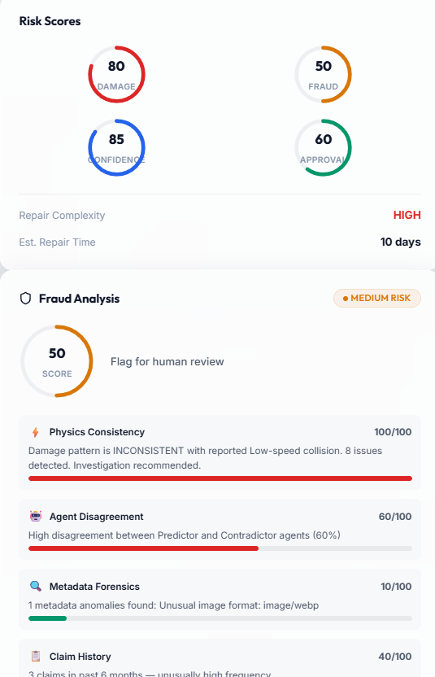
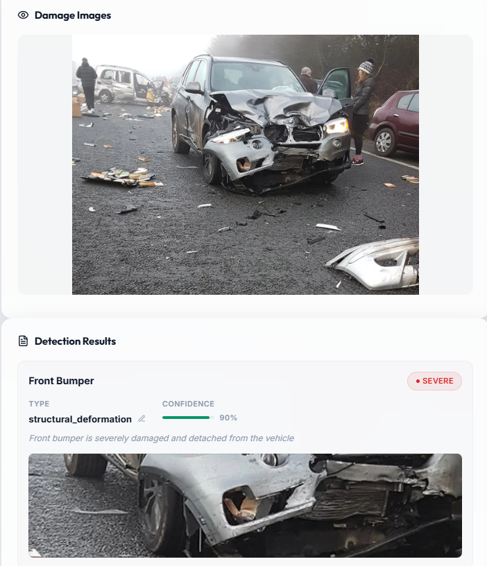

# AutoClaim AI — Intelligent Vehicle Damage Assessment

AutoClaim AI is an advanced, automated vehicle damage assessment platform that uses a **Tri-Agent architecture** to evaluate claims, detect fraud, and generate explainable cost estimates. Built with React and a modern glassmorphic UI, it provides a seamless experience for both customers submitting claims and adjusters reviewing them.

## ADDITIONAL FEAUTRES ADDED TO MAKE THIS SOLUTION UNIQUE 

- **TRI-AGENT AI Pipeline:**
  - USES 3 AI AGENTS TO WORK AND COMMUNICATE WITH EACH OTHER TO PROVIDE EXACT SCORING, THIS IS A UNIQUE FEATURE TO REDUCE ERROS IN THE SYSTEM
  - **Predictor Agent (Vision):** Analyzes uploaded damage photos to identify parts, damage types, severity, dent depths, and impact angles.
  - **Contradictor Agent (Adversarial):** Challenges the Predictor's findings using physics consistency rules and fraud detection heuristics.
  - **Arbiter Agent (Verdict):** Reconciles differences and issues a final, explainable verdict (Auto-Approve, Needs Review, or Escalate to SIU).
  - 
  - HERE'S THE ATTACHED SCREENSHOT TO REFER TO THE COMMUNICATION BETWEEN AI AGENTS FOR SCORING

- **Machine Learning & Feedback Loop:**
  - Captures human adjuster overrides and corrections.
  - Automatically simulates retraining batches to track accuracy improvements over time.
  - Features a Champion/Challenger model registry with rollback capabilities.
  - 

- **Physics Validation & Fraud Detection:**
  - Composite fraud scoring combining physics inconsistencies, agent disagreements, and anomaly detection.
  - Estimates impact speed and validates damage consistency against the reported incident type (e.g., Rear-end vs. Side impact).
  - 

- **Explainable Adjuster Dashboard:**
  - AI HIGHLIGHTS AND CROPS EXACTLY WHERE THE DAMAGE IS AND REASONS IT USING THE TRI AGENT SYSTEM 
     
  - CHECK THE IMAGE TO REFER HOW THE AI HIGLIGHTS AND CROPS IT
  - Full traceability for repair vs. replace decisions and associated costs.
  - Interactive audit logs detailing the exact "conversation" between the 3 AI agents.

## 🚀 Tech Stack

- **Frontend:** React + Vite
- **Styling:** Custom CSS with Glassmorphism, CSS Variables, and responsive design (No Tailwind).
- **Icons:** Lucide React
- **AI Integration:** Groq (LLaMA Vision models) / Google Gemini fallback
- **State Management:** React Context API + LocalStorage persistence

## 🛠️ Getting Started

### Prerequisites
- Node.js (v18+)
- npm or yarn

### Installation

1. Clone the repository:
   ```bash
   git clone https://github.com/yourusername/autoclaim-ai.git
   cd autoclaim-ai
   ```

2. Install dependencies:
   ```bash
   npm install
   ```

3. Start the development server:
   ```bash
   npm run dev
   ```
   The app will be available at `http://localhost:5173`.

## 📁 Project Structure

- `src/agents/` - The Tri-Agent Core (Predictor, Contradictor, Arbiter, Orchestrator)
- `src/api/` - LLM service integrations with key rotation
- `src/data/` - Business logic (Pricing Engine, Physics Engine, Fraud Detector, Feedback Loop)
- `src/pages/` - React views (Submit Claim, Processing, Dashboard, Claim Detail)
- `src/context/` - Global state management for claims

## 📜 License

This project is licensed under the MIT License.
